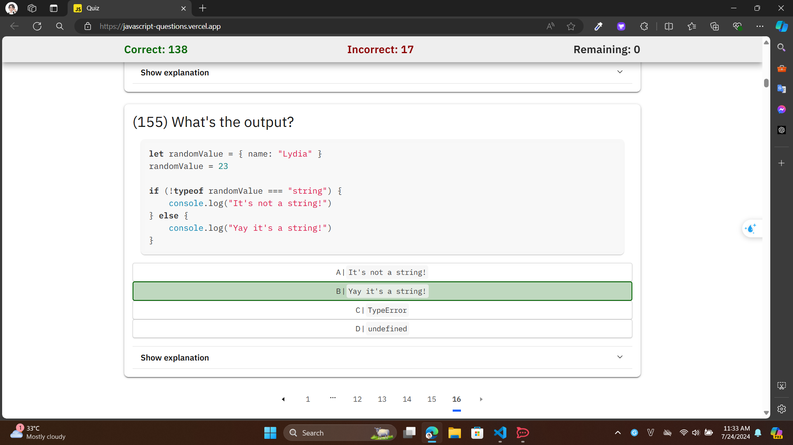

# Quiz wrong answer

20.

```js
function getAge() {
  "use strict";
  age = 21;
  console.log(age);
}

getAge();
```

A | 21
B | undefined
C | ReferenceError
D | TypeError

- Answer: C
- My choose: D
- Reson: I haven't been able to identify the error

56

```js
const set = new Set([1, 1, 2, 3, 4]);

console.log(set);
```

A | [1, 1, 2, 3, 4]
B | [1, 2, 3, 4]
C | {1, 1, 2, 3, 4}
D | {1, 2, 3, 4}

- Answer: D
- My choose: B
- Reson: set is an object.

88

```js
function sum(num1, num2 = num1) {
  console.log(num1 + num2);
}

sum(10);
```

A | NaN
B | 20
C | ReferenceError
D | undefined

- Answer: B
- My choose: A
- Reson: Can set a default parameter's value equal to another parameter of the function

96

```js
class Person {
  constructor() {
    this.name = "Lydia";
  }
}

Person = class AnotherPerson {
  constructor() {
    this.name = "Sarah";
  }
};

const member = new Person();
console.log(member.name);
```

A | "Lydia"
B | "Sarah"
C | Error: cannot redeclare Person
D | SyntaxError

- Answer: B
- My choose: D
- Reson: Can set classes equal to other classes/function constructors.

99

```js
const name = "Lydia";

console.log(name());
```

A | SyntaxError
B | ReferenceError
C | TypeError
D | undefined

- Answer: C
- My choose: A
- Reson: TypeErrors get thrown when a value is not of the expected type.

104

```js
Promise.resolve(5);
```

A | 5
B | Promise {<pending>: 5}
C | Promise {<fulfilled>: 5}
D | Error

- Answer: C
- My choose: B
- Reson: The method itself returns a promise with the resolved value (<fulfilled>)

105

```js
function compareMembers(person1, person2 = person) {
  if (person1 !== person2) {
    console.log("Not the same!");
  } else {
    console.log("They are the same!");
  }
}

const person = { name: "Lydia" };

compareMembers(person);
```

A | Not the same!
B | They are the same!
C | ReferenceError
D | SyntaxError

- Answer: B
- My choose: A
- Reson: Objects are passed by reference. When we check objects for strict equality (===), we're comparing their references.

122

```js
const name = "Lydia Hallie";

console.log(!typeof name === "object");
console.log(!typeof name === "string");
```

A | false true
B | true false
C | false false
D | true true

- Answer: C
- My choose: B
- Reson: typeof first then ! and then ===

# End


